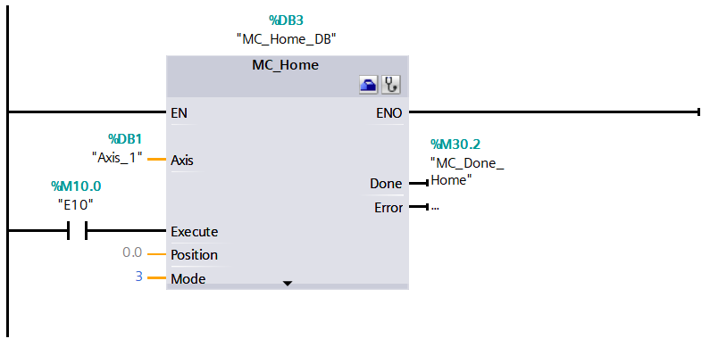
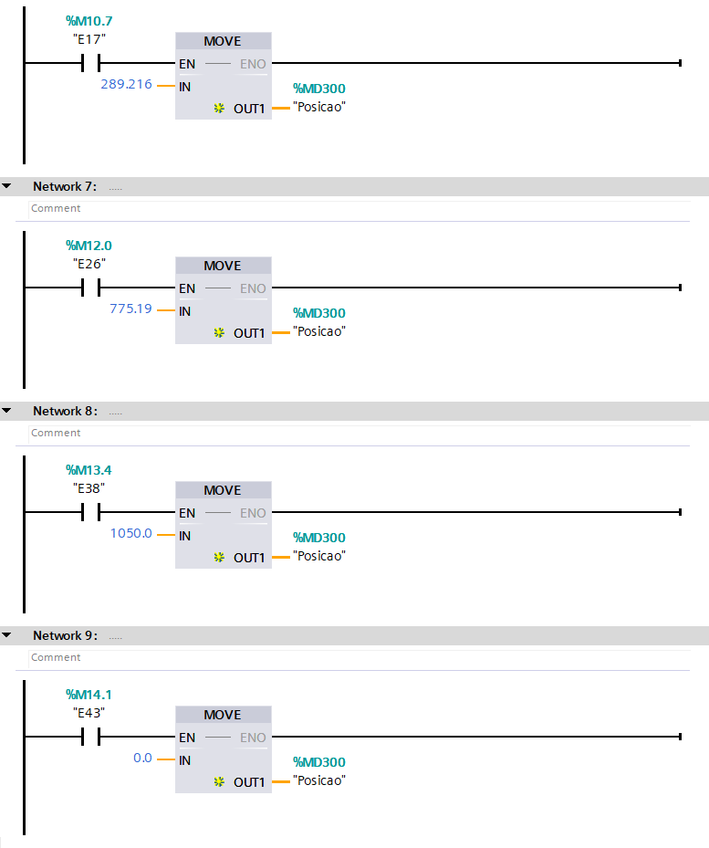
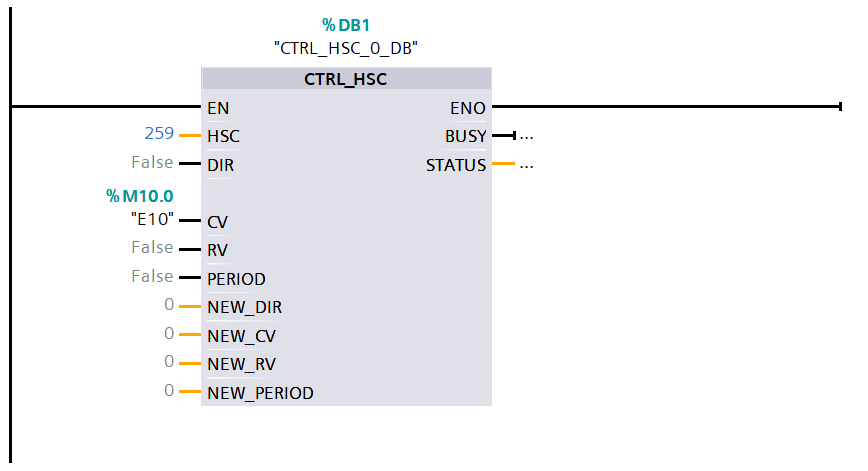
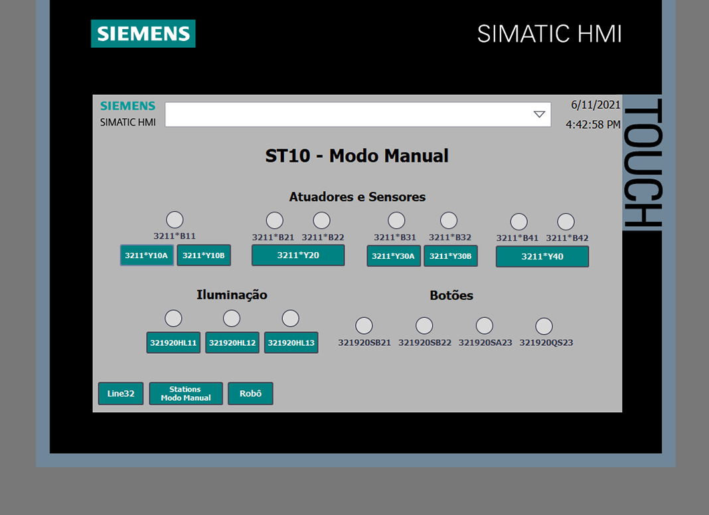
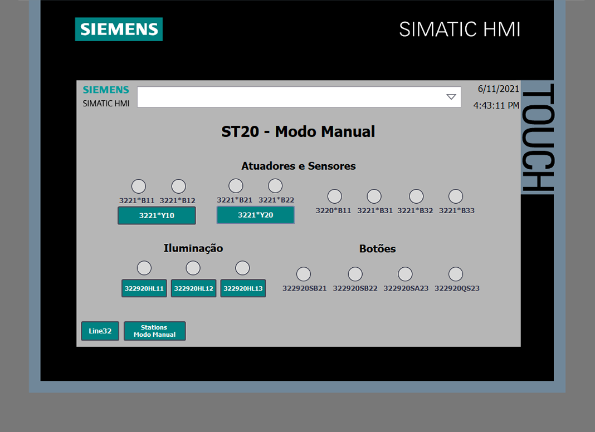
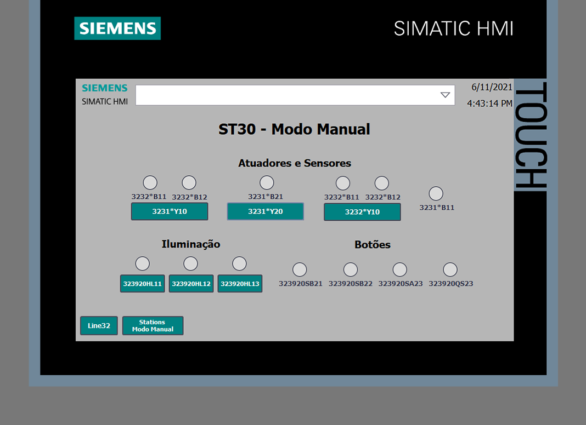
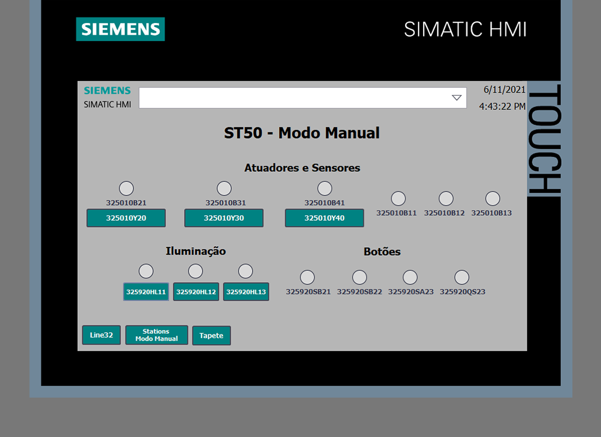
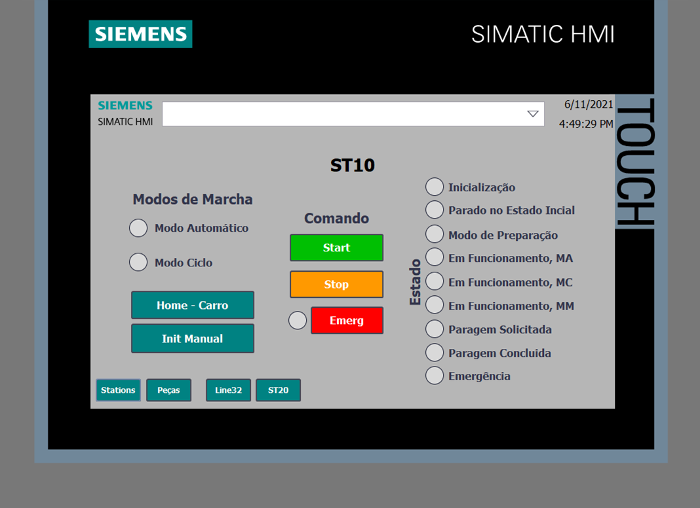
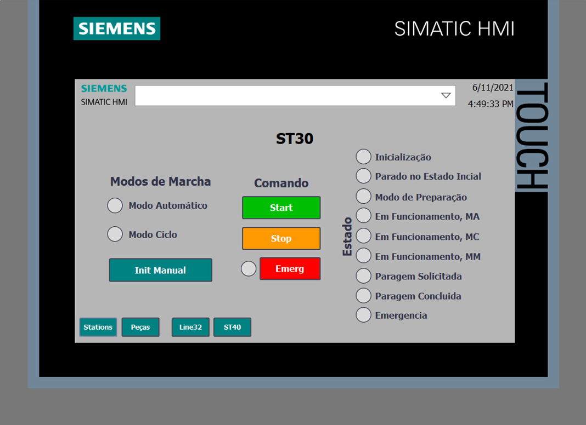
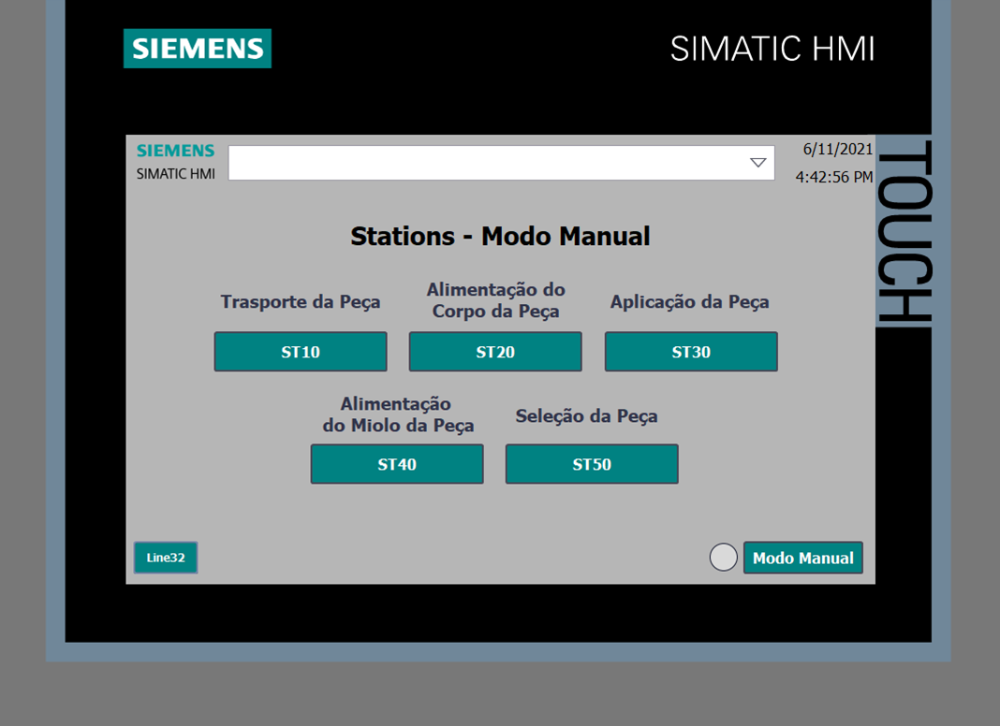

# Line 32

**Autor:** *Luis Barroso*

**Data:** *Last Upgrade: 13/06/2021, 16h54*

- [Trabalho fora da Line](./o_lines/o_lines.md)

- [Introdução](#introducao)
- [Processo](#processo)
    - [Peças](#pecas)
    - [Estações](#estacoes)
        - [Estação 10](#)
        - [Estação 20](#)
        - [Estação 30](#) 
        - [Estação 40](#)
        - [Estação 50](#)
    - [Modo de Funcionamento](#modo-de-funcionamento)
    - [Comunicações](#comunicacoes)
        - [Profinet](#)
            - [Zonas de Comunicação](#)
        - [Modbus](#)
            - [Zonas de Comunicação](#)
- [Trabalho Realizado](#trabalho-realizado)
    - [Classificação](#classificacao)
        - [Estação 10](#)
            - [Entradas e Saidas (PLC)](#)
                - [Entradas](#)
                - [Saidas](#)
            - [Memórias](#)
            - [Comunicações](#)
                - [Entradas](#)
                - [Saidas](#)
        - [Estação 20](#)
            - [Entradas e Saidas (PLC)](#)
                - [Entradas](#)
                - [Saidas](#)
            - [Memórias](#)
            - [Comunicações](#)
                - [Entradas](#)
                - [Saidas](#)
        - [Estação 30](#)
            - [Entradas e Saidas (PLC)](#)
                - [Entradas](#)
                - [Saidas](#)
            - [Memórias](#)
            - [Comunicações](#)
                - [Entradas](#)
                - [Saidas](#)
        - [Estação 40](#)
            - [Entradas e Saidas (PLC)](#)
                - [Entradas](#)
                - [Saidas](#)
            - [Memórias](#)
            - [Comunicações](#)
                - [Entradas](#)
                - [Saidas](#)
        - [Estação 50](#)
            - [Entradas e Saidas (PLC)](#)
                - [Entradas](#)
                - [Saidas](#)
            - [Memórias](#)
            - [Comunicações](#)
                - [Entradas](#)
                - [Saidas](#)      
    - [Software](#software)
        - [Grafcets](#grafcets)
            - [Estação 10](#)
            - [Estação 20](#)
            - [Estação 30](#) 
            - [Estação 40](#)
            - [Estação 50](#)
        - [Gemma](#gemma)
            - [Esquema](#esquema)
            - [Guia de Iluminação](#guia-de-iluminacao)
            - [Grafcet’s](#grafcet-s)
                - [Gemma Master](#gemma-master)
                - [Gemma Estações](#gemma-estacoes)
                - [Gemma Iluminação Master](#gemma-iluminacao-master)
                - [Gemma Iluminação Estações](#gemma-iluminacao-estacoes)
            - [Modos de Marcha](#modos-de-marcha)        
        - [Programação](#programacao)
            - [Estação 10](#)
            - [Estação 50](#)
            - [Inicialização](#)        
            - [Modo de Funcionamento](#)
            - [Modo de Marcha](#)
            - [Botões](#)
        - [HMI](#hmi)  
        - [Tesla Scada](#tesla-scada)
- [Anexos](#anexos)

## Introdução

A Line 32 é uma das Lines do Grupo 30. Divida em 5 estações das quais resultam: **"Transporte (Estação 10)"**, **"Aplicação (Estação 30)"**, **"Alimentação (Corpo (Estação 20) e Miolo (Estação 40))"** e **"Seleção (Estação 50)"**.

## Processo

A Line 32, do Grupo 30, consiste num conjunto de estações, **cada uma com Equipamentos/Componentes independentes**. A Line 32, assim com cada uma da estações, funcionam usando **sistemas pneumáticos** e **sistemas eletromecânicos**.

Os **sistemas pneumáticos** estão presentes em todas as estações. Responsáveis pelos movimentos dos Cilindros, ou seja, avanço e recuo. Já os **sistemas eletromecânicos** só estão presentes nas estações 10 e 50. Na estação 10, são responsáveis pelo movimento do **robô**. Este robô é utilizado para o transporte das peças pelas diversas estações. Acoplado ao robô, temos uma **garra**, sendo assim possível realizar as tarefas pretendidas, com por exemplo, o avança e recuo da garra. Para se deslocar pelas diversas estações, o robô, está conectado a um **Servo Motor** (Simotics S-1FL6) e um **Inversor de Frequência** (Siemens V90); Na estação 50, são responsáveis pelo movimento do tapete. Para o movimento deste tapete é usado um **Motor Trifásico** que acoplado tem um **Enconder**, que, através da sua posição é possível fazer o encaminhamento das peças. Para a movimento do Motor é utilizado um **Inversor de Frequência** (Siemens G120C), que converte o sinal elétrico em sinal analógico sendo assim possível fazer o 
movimento do tapete e controlo da velocidade.

Para o controlo das peças são usados Sensores, como: **Sensores Fotoelétricos**, usados para a deteção das peças em determinadas posições; **Sensores Indutivos** usados para distinguir as peças metálicas das peças de plástico; **Sensores Óticos** usados para distinguir a peças brancas das peças pretas e **Sensores Magnéticos** usados para detetar a posição da haste do cilindro.

Para a comunicação entre as diversas estações é usado o protocolo de comunicação **PROFINET**, este protocolo é baseado em **Ethernet**, ou seja, todas as comunicações entre PC/PLC ou PLC/PLC são feitas em rede. No programa TIA Portal é definida uma área de transferência de Bytes, desta forma, tanto o Master com os Slaves podem operar na zona definida. 

### Peças

Peças, constituídas por Corpo (Parte Exterior) e por um Miolo (Parte Interior). Representa o objeto processado na Line32, quando os elementos são unificados representam o produto final. Podem ser classificadas de 9 maneiras, como nos mostra a tabela abaixo.

||Metálico|Branco|Preto|
-| ------ | ---- | --- |
Metálico|**x**|x|x|
Branco|x|**x**|x|
Preto|x|x|**x**|

Os **x** a negrito indicados as combinações pretendidas, quando essas combinações são processadas são encaminhadas para o respetivo armazém.

### Estações

#### Estação 10

A Estação 10, **estação de transporte da peça**, desde a sua fase inicial até à sua finalização. A Estação 10 é constituída por 7 sensores e 6 cilindros, dos quais resultam: Sensor de Garra em baixo, Sensor de Garra em cima, Sensor de Garra de rotação à esquerda, Sensor de Garra de rotação à direita, Sensor de Garra avançada, Sensor de Garra recuada, Sensor de Garra fechada; Cilindro de Garra subida e descida, Cilindro de rotação à esquerda da Garra, Cilindro de rotação à direita da Garra, Cilindro de Garra avançada e recuada, Cilindro de fecho da Garra, Cilindro de abertura da Garra.

**Modo de Funcionamento da Estação 10**: Assim que o corpo da peça é processado pela estação 20, a garra avança, fecha e soube. Assim que concluído este processo avança para a próxima estação. Já na estação 30, a garra avança, baixa, abre, recua e aguarda que a peça seja processada pela estação 30. Assim que concluído este processo, a garra avança, fecha, soube, recua e avança para a próxima estação. Já na estação 40, a garra avança, baixa, abre, recua e aguarda que a peça seja processada pela estação 40. Assim que concluído este processo, a garra avança, baixa, fecha, soube, recua, roda para a esquerda e avança para a próxima estação. Já na estação 50, a garra avança, baixa, abre, recua. Assim que concluído este processo, retorna para a sua posição de *home*. Quando alcançar a posição de *home*, a garra, roda para a direita, desta forma, está pronta para começar um novo ciclo.

#### Estação 20

A Estação 20, **estação de alimentação do corpo da peça**, o corpo da peça, é colocado no funil para ser processado. A Estação 20 é constituída por 8 sensores e 2 cilindros, dos quais resultam: Sensor de Peça à Frente, Sensor Cilindro1 Avançado, Sensor Cilindro1 Recuado, Sensor Cilindro2 Avançado, Sensor Cilindro2 Recuado, Sensor no Funil (Cima), Sensor no Funil (Baixo), Sensor de Peça Metálica; Cilindro 1, Cilindro 2.

**Modo de Funcionamento da Estação 20**: Assim que o corpo da peça é detectado pelo sensor (Sensor no Funil (Baixo)), o Cilindro 2 avança, isto para evitar que a segunda peça caia antes do Cilindro 1 recuar. Com o Cilindro 2 avançado, o Cilindro 1 avança, colocando a peça á frente, em posição para a Estação 10 a processar. Enquanto a peça se encontrar á frente não será processada mais nenhuma peça. Quando esta peça for retirada pelo robô, uma nova peça ser+a processada.

#### Estação 30

A Estação 30, **estação de aplicação**, é aplicada uma *cola* para fixar o miolo ao corpo da peça. A Estação 30 é constituída por 7 sensores e 6 cilindros, dos quais resultam: Sensor de peça na Pinça, Sensor de Pinça aberta e fechada, Sensor de Pinça avancada, Sensor de Pinça recuada, Sensor de Prensa subida, Sensor de Prensa descida; Cilindro de fecho da Pinça, Cilindro de Pinça avançada e recuada, Cilindro da Prensa subida e descida.

**Modo de Funcionamento da Estação 30**: Assim que o corpo da peça é detectado pelo sensor (Sensor de peça na Pinça), a Pinça fecha e recua. Quando for deteta pelo sensor (Sensor de Pinça recuada), a peça, é processada pela prensa. Assim que concluído este processamento, a pinça, avança e abre para que o corpo da peça possa seguir para a próxima estação.

#### Estação 40

A Estação 40, **estação de alimentação do miolo da peça**, o miolo da peça, é colocado na funil para ser processado. A Estação 40 é constituída por 16 sensores e 6 cilindros, dos quais resultam: Sensor Cilindro1 Avançado, Sensor Cilindro1 Recuado, Sensor Cilindro2 Avançado, Sensor Cilindro2 Recuado, Sensor Prato de rotação à esquerda, Sensor Prato de rotação à direita, Sensor copo em cima, Sensor copo em baixo, Sensor do Prato à esquerda, Sensor do Prato à direita, Sensor de Garra avançada, Sensor de Garra recuada, Sensor de Garra subida, Sensor de Garra descida, Sensor de Garra fechada, Sensor de Peça à frente; Cilindro 1, Cilindro 2, Cilindro Prato, Cilindro da Garra avançada e recuada, Cilindro da Garra subida e descida, Cilindro da Garra aberta e fechada.

**Modo de Funcionamento da Estação 40**: Assim que o miolo da peça é detetada pelo sensor (Sensor copo em baixo), o miolo é processado, ou seja, cai e o prato roda para que depois seja colocado no corpo da peça. Esta informação fica guardada e assim que o corpo da peça foi recebido pela estação, a garra processa o miolo, colocando-o no corpo da peça. Assim que concluído este processo a peça esta concluída e pronta a seguir para a próxima estação.

#### Estação 50

A Estação 50, **estação de seleção**, responsável por ordenar as peças no respetivo armazém.  Estação 40 é constituída por 6 sensores e 3 cilindros, dos quais resultam:
Sensor de Peça no Tapete, Sensor de Peça Metálica, Sensor de Peça Branca/Metálica, Sensor Cilindro1 Avançado, Sensor Cilindro2 Avançado, Sensor Cilindro3 Avançado; Cilindro 1, Cilindro 2, Cilindro 3.

**Modo de Funcionamento da Estação 40**: Assim que a peça é detetada pelo sensor (Sensor de Peça no Tapete), o tapete entra em funcionamento, a peça é identificada, pelos sensores e encaminhada. Caso for uma peça pretendida (Metálico/Metálico; Branco/Branco; Preto/Preto) é encaminhada para o respetivo armazém, senão, a peça é rejeitada. 

### Modo de Funcionamento

Assim que a Estação 20 for alimentada com o corpo da peça, essa informação é enviada para o PLC Master (Estação 10), assim que recebida, a peça é processada. Quando concluído o processamento, a peça, esta pronta para o robô a processar e avançar para a próxima estação. Quando o robô estiver na posição relativa à estação 30, a garra avança e pousa a peça na pinça e a peça é processada. Quando concluído o processamento, a peça, esta pronta para o robô a processar e avançar para a próxima estação. Quando o robô estiver na posição relativa à estação 40, a garra avança e pousa a peça *suporte*. Assim que o corpo da peça for recebido pela estação 40, a estação entra em processamento, ou seja, o miolo é colocado no corpo da peça. Quando concluído o processamento, a peça, esta pronta para o robô a processar e avançar para a próxima estação. Quando o robô estiver na posição relativa à estação 50, a garra avança e pousa a peça no tapete. O tapete entra em funcionamento, a peça é identificada, pelos sensores e encaminhada. Caso for uma peça pretendida (Metálico/Metálico; Branco/Branco; Preto/Preto) é encaminhada para o respetivo armazém, senão, a peça é rejeitada. Depois do robô, pousar a peça no tapete da estação 50, retorna para a sua posição de *home* e desta forma o ciclo foi concluído e pronto a realizar um novo ciclo. 

A Line 32 é composta por 3 modos de funcionamento: **Local**, **HMI** e **Remoto**. **No Modo de Funcionamento Local**, os comandos para as estações são dados através da Botoneiras. Já os comandos para a line são dados pela HMI. **No Modo de Funcionamento HMI**, todos os comandos, tanto para as estações como para a line, são dados pela HMI. **No Modo de Funcionamento Remoto**, todos os comandos, tanto para as estações como para a line, são dados remotamente, usando o software Tesla Scada. Quando um destes Modos de Funcionamento é selecionado, na HMI, os outros dois modos, mesmo que sejam selecionados, não terão efeito, prevenido assim qualquer acidente ou falha no sistema. Assim que um destes três modos de funcionamento for selecionados, todos os comandos, depende do modo selecionado. Por exemplo: se estivermos a funcionar em modo HMI, se forem dados comandos através da Botoneiras ou através do Tesla Scada, este comandos não funcionaram, pois o Modo HMI está selecionado. 

        Screenshot do Codigo do Botões e da Selecão do Modos
        Futuramente: Video!

### Comunicações

### Profinet
#### Zonas de Comunicação

|PLC |Address in I/O Controller  | |Address in I-Device|
--- | --- | :---: | ---
19PLC|I100, I101, I102, I103|←| Q100, Q101, Q102, Q103
-|Q100, Q101, Q102, Q103|→|I100, I101, I102, I103
29PLC|I104, I105, I106, I107|←|Q104, I105, Q106, Q107
-|Q104, I105, Q106, Q107|→|I104, I105, I106, I107
39PLC|I108, I109, I110, I111|←|Q108, Q109, Q110, Q111
-|Q108, Q109, Q110, Q111|→|I108, I109, I110, I111
49PLC|I112, I113, I114, I115|←|Q112, Q113, Q114, Q115
-|Q112, Q113, Q114, Q115|→|I112, I113, I114, I115
59PLC|I116, I117, I118, I119|←|Q116, Q117, Q118, Q119
-|Q116, Q117, Q118, Q119|→|I116, I117, I118, I119

### Modbus
#### Zonas de Comunicação

## Trabalho Realizado
### Classificação
#### Estação 10
##### Entradas e Saídas (PLC)
###### Entradas 19PLC

|Label |Endereço  | Comentário|
--- | --- | ---
3211*B42|%I0.3|Sensor de Garra em Baixo
3211*B41|%I0.4|Sensor de Garra em Cima
3211*B32|%I0.5|Sensor Garra (Rotação)
3211*B31|%I0.6|Sensor Garra (Posição Inicial)
3211*B21|%I0.7|Sensor de Garra á Frente
3211*B22|%I1.0|Sensor de Garra Atrás
3211*B11|%I1.1|Sensor de Garra Fechada
Reset_HMI_Inputs|%IB2|
HMI_SB1|%I2.0|
HMI_SB2|%I2.1|
HMI_QS|%I2.2|
HMI_SB1_ST10|%I2.3|
HMI_SB2_ST10|%I2.4|
HMI_QS_ST10|%I2.5|
HMI_Modo_HMI|%I2.6|
HMI_Modo_Local|%I2.7|
Reset_HMI_Inputs_2|%IB3|
HMI_Modo_Scada|%I3.0|
Init_Manual|%I3.1|
HMI_MM_Automatico|%I3.2|
HMI_MM_Ciclo|%I3.3|
HMI_MM_Manual|%I3.4|
HMI_MC_Power_Enable|%I3.5|
HMI_MC_Home_Execute_A|%I3.6|
HMI_MC_Home_Execute|%I3.7|
Reset_HMI_Inputs_3|%IB4|
HMI_MC_Reset_Execute|%I4.0|
HMI_MC_MoveJog_Esq|%I4.1|
HMI_MC_MoveJog_Drt|%I4.2|
HMI_MC_MoveAbsolute_Execute|%I4.3|
HMI_MC_MoveRelative_Execute|%I4.4|
HMI_MC_Halt_Execute|%I4.5|
HMI_Teste_Luzes|%I4.6|
HMI_Posicao_ST20|%I4.7|
Reset_HMI_Inputs_4|%IB5|
HMI_Posicao_ST30|%I5.0|
HMI_Posicao_ST40|%I5.1|
HMI_Posicao_ST50|%I5.2|
HMI_Testes_Cilindros|%I5.3|
HMI_Init_Manual_All_STS|%I6.0|
321920SB22|%I8.4|Botão Vermelho
321920SB21|%I8.5|Botão Verde
321920QS24|%I8.6|Botão Emergência
321920SA23|%I8.7|Seletor

###### Saídas 19PLC

|Label |Endereço  | Comentário|
--- | --- | ---
3211*Y40|%Q0.3|Cilindro da Garra (Sobe e Baixa)
3211*Y30B|%Q0.4|Cilindro da Garra (Rotação)
3211*Y30A|%Q0.5|Cilindro da Garra (Posição Inicial)
3211*Y20|%Q0.6|Cilindro da Garra (Frente e Atrás)
3211*Y10B|%Q0.7|Cilindro de Fecho Garra
3211*Y10A|%Q1.0|Cilindro de Abertura da Garra
321920HL11|%Q8.5|Painel Luz Laranja
321920HL12|%Q8.6|Painel Luz Verde
321920HL13|%Q8.7|Painel Luz Vermelha

##### Memórias

|Label |Endereço  | Comentário|
--- | --- | ---
Grafcet_10|%MB10|
E10|%M10.0|
E11|%M10.1|
E12|%M10.2|
E13|%M10.3|
E14|%M10.4|
E15|%M10.5|
E16|%M10.6|
E17|%M10.7|
Grafcet_10_1|%MB11
E18|%M11.0|
E19|%M11.1|
E20|%M11.2|
E21|%M11.3|
E22|%M11.4|
E23|%M11.5|
E24|%M11.6|
E25|%M11.7|
Grafcet_10_2|%MB12|
E26|%M12.0|
E27|%M12.1|
E28|%M12.2|
E29|%M12.3|
E30|%M12.4|
E31|%M12.5|
E32|%M12.6|
E33|%M12.7|
Grafcet_10_3|%MB13|
E34|%M13.0|
E35|%M13.1|
E36|%M13.2|
E37|%M13.3|
E38|%M13.4|
E39|%M13.5|
E40|%M13.6|
E41|%M13.7|
Grafcet_10_4|%MB14|
E42|%M14.0|
E43|%M14.1|
E44|%M14.2|
E45|%M14.3|
E46|%M14.4|
MC_Absolute_Done|%M15.0|
MC_Relative_Done|%M15.1|
MC_Home_Done|%M15.2|
MC_Execute_Reset|%M15.3|
MC_Halt_Done|%M15.4|
Grafcet_Gemma_M|%MB16|
A6_M|%M16.0|
A1_M|%M16.1|
F2_M|%M16.2|
F1_M|%M16.3|
F5_M|%M16.4|
F6_M|%M16.5|
A3_M|%M16.6|
A4_M|%M16.7|
Grafcet_Gemma_M_1|%MB17|
D1_M|%M17.0|
Grafcet_Gemma|%MB18|
A6|%M18.0|
A1|%M18.1|
F2|%M18.2|
F1|%M18.3|
F1_1|%M18.4|
F5|%M18.5|
F6|%M18.6|
A3|%M18.7|
Grafcet_Gemma_1|%MB19|
A4|%M19.0|
D1|%M19.1|
Reset_ST10_Memorys|%MB20|
Grafcet_Parado|%M20.0|
Grafcet_Emergencia|%M20.1|
O_Start|%M20.2|
O_Stop|%M20.3|
O_Emerg|%M20.4|
O_Marcha_A|%M20.5|
O_Marcha_C|%M20.6|
A6_ST10|%M20.7|
Reset_ST10_Memorys_1|%MB21|
A1_ST10|%M21.0|
F2_ST10|%M21.1|
F1_ST10|%M21.2|
F5_ST10|%M21.3|
F6_ST10|%M21.4|
A3_ST10|%M21.5|
A4_ST10|%M21.6|
D1_ST10|%M21.7|
Reset_ST10_Memorys_2|%MB22|
Emerg_M_ST10|%M22.0|
Stop_M_ST10|%M22.1|
Init_M_ST10|%M22.2|
MM_A_ST10|%M22.3|
MM_C_ST10|%M22.4|
MM_M_ST10|%M22.5|
MF_HMI_ST10|%M22.6|
MF_SCADA_ST10|%M22.7|
Reset_ST10_Memorys_3|%MB23|
MF_Local_ST10|%M23.0|
Scada_O_Start_ST10|%M23.1|
Scada_O_Stop_ST10|%M23.2|
Scada_O_Emerg_ST10|%M23.3|
O_Start_M|%M23.7|
Reset_ST10_Memorys_4|%MB24|
O_Stop_M|%M24.0|
O_Emerg_M|%M24.1|
HL11_ON/OFF_Condition|%M30.0|
HL12_ON/OFF_Condition|%M30.1|
HL13_ON/OFF_Condition|%M30.2|
MC_MoveAbsolute_Position|%MD300|
MC_MoveAbsolute_Velocity|%MD304|
HMI_MC_MoveRelative_Distance|%MD308|
HMI_MC_MoveAbsolute_Position|%MD312|
HMI_MC_MoveRelative_Velocity|%MD316|
HMI_MC_MoveAbsolute_Velocity|%MD320|
HMI_MC_MoveAbsolute_Velocity_2|%MD324|
HMI_MC_MoveJog_Velocity|%MD328|

##### Comunicações

###### Entradas

|Label |Endereço  | Comentário|
--- | --- | ---	
Tag_1|%IB100|
Tag_2|%IB101|
Tag_3|%IB102|
Tag_4|%IB103|
Tag_9|%IB104|
ST20_Ok|%I104.0|
A6_ST20|%I104.1|
A1_ST20|%I104.2|
F2_ST20|%I104.3|
F1_ST20|%I104.4|
A3_ST20|%I104.5|
F5_ST20|%I104.6|
F6_ST20|%I104.7|
Tag_10|%IB105|
A4_ST20|%I105.0|
D1_ST20|%I105.1|
Tag_11|%IB106|
Tag_12|%IB107|
Tag_17|%IB108|
ST30_Ok|%I108.0|
A6_ST30|%I108.1|
A1_ST30|%I108.2|
F2_ST30|%I108.3|
F1_ST30|%I108.4|
F5_ST30|%I108.5|
F6_ST30|%I108.6|
A3_ST30|%I108.7|
Tag_18|%IB109|
A4_ST30|%I109.0|
D1_ST30|%I109.1|
Tag_19|%IB110|
Tag_20|%IB111|
Tag_25|%IB112|
ST40_Ok|%I112.0|
A6_ST40|%I112.1|
A1_ST40|%I112.2|
F2_ST40|%I112.3|
F1_ST40|%I112.4|
F5_ST40|%I112.5|
F6_ST40|%I112.6|
A3_ST40|%I112.7|
Tag_26|%IB113|
A4_ST40|%I113.0|
D1_ST40|%I113.1|
Tag_27|%IB114|
Tag_28|%IB115|
Tag_33|%IB116|
ST50_Ok|%I116.0|
A6_ST50|%I116.1|
A1_ST50|%I116.2|
F2_ST50|%I116.3|
F1_ST50|%I116.4|
F5_ST50|%I116.5|
F6_ST50|%I116.6|
A3_ST50|%I116.7|
Tag_34|%IB117|
A4_ST50|%I117.0|
D1_ST50|%I117.1|
Tag_35|%IB118|
Tag_36|%IB119|

###### Saídas

|Label |Endereço  | Comentário|
--- | --- | ---	
Tag_6|%QB100|
Tag_5|%QB101|
Tag_7|%QB102|
Tag_8|%QB103|
Tag_13|%QB104|
ST10_Ok_ST20|%Q104.0|
Tag_14|%QB105|
Emerg_M_ST20|%Q105.2|
Stop_M_ST20|%Q105.3|
Init_M_ST20|%Q105.4|
MM_A_ST20|%Q105.5|
MM_C_ST20|%Q105.6|
MM_M_ST20|%Q105.7|
Tag_15|%QB106|
MF_HMI_ST20|%Q106.0|
MF_SCADA_ST20|%Q106.1|
MF_Local_ST20|%Q106.2|
HLs_ST20|%Q106.3|
Scada_O_Start_ST20|%Q106.4|
Scada_O_Stop_ST20|%Q106.5|
Scada_O_Emerg_ST20|%Q106.6|
Cilindros_ST20|%Q106.7|
Tag_16|%QB107|
Tag_21|%QB108|
ST10_Ok_ST30|%Q108.0|
Tag_22|%QB109|
Emerg_M_ST30|%Q109.2|
Stop_M_ST30|%Q109.3|
Init_M_ST30|%Q109.4|
MM_A_ST30|%Q109.5|
MM_C_ST30|%Q109.6|
MM_M_ST30|%Q109.7|
Tag_23|%QB110|
MF_HMI_ST30|%Q110.0|
MF_Local_ST30|%Q110.1|
MF_SCADA_ST30|%Q110.2|
HLs_ST30|%Q110.3|
Scada_O_Start_ST30|%Q110.4|
Scada_O_Stop_ST30|%Q110.5|
Scada_O_Emerg_ST30|%Q110.6|
Cilindros_ST30|%Q110.7|
Tag_24|%QB111|
Tag_29|%QB112|
ST10_Ok_ST40|%Q112.0|
Tag_30|%QB113|
A6_M_ST40|%Q113.2|
A1_M_ST40|%Q113.3|
F2_M_ST40|%Q113.4|
F1_M_ST40|%Q113.5|
F5_M_ST40|%Q113.6|
F6_M_ST40|%Q113.7|
Tag_31|%QB114|
A3_M_ST40|%Q114.0|
D1_M_ST40|%Q114.1|
A4_M_ST40|%Q114.2|
Emerg_M_ST40|%Q114.3|
Stop_M_ST40|%Q114.4|
Init_M_ST40|%Q114.5|
MM_A_ST40|%Q114.6|
MM_C_ST40|%Q114.7|
Tag_32|%QB115|
MM_M_ST40|%Q115.0|
MF_HMI_ST40|%Q115.1|
MF_SCADA_ST40|%Q115.2|
MF_Local_ST40|%Q115.3|
Cilindros_ST40_HLs_ST40|%Q115.4|
Scada_O_Start_ST40|%Q115.5|
Scada_O_Stop_ST40|%Q115.6|
Scada_O_Emerg_ST40|%Q115.7|
Tag_37|%QB116|
ST10_Ok_ST50|%Q116.0|
Emerg_M_ST50|%Q117.2|
Stop_M_ST50|%Q117.3|
Init_M_ST50|%Q117.4|
MM_A_ST50|%Q117.5|
MM_C_ST50|%Q117.6|
MM_M_ST50|%Q117.7|
Tag_38|%QB118|
MF_HMI_ST50|%Q118.0|
MF_SCADA_ST50|%Q118.1|
MF_Local_ST50|%Q118.2|
HLs_ST50|%Q118.3|
Scada_O_Start_ST50|%Q118.4|
Scada_O_Stop_ST50|%Q118.5|
Scada_O_Emerg_ST50|%Q118.6|
Cilindros_ST50|%Q118.7|
Tag_39|%QB119|

#### Estação 20
##### Entradas e Saídas (PLC)
###### Entradas 29PLC

|Label |Endereço  | Comentário|
--- | --- | ---
3220*B11|%I0.4|Sensor de Peça à Frente
3221*B11|%I0.0|Sensor Cilindro1 Avançado
3221*B12|%I0.1|Sensor Cilindro1 Recuado
3221*B21|%I0.2|Sensor Cilindro2 Avançado
3221*B22|%I0.3|Sensor Cilindro2 Recuado
3221*B32|%I0.5|Sensor no Copo (Cima)
3221*B33|%I0.6|Sensor no Copo (Baixo)
3221*B31|%I0.7|Sensor de Peça Metálica
322920SB22|%I1.2|Botão Vermelho
322920SB21|%I1.3|Botão Verde
322920QS24|%I1.4|Botão Emergência
322920SA23|%I1.5|Seletor
Reset_HMI_Inputs|%IB2|
HMI_SB1|%I2.0|
HMI_SB2|%I2.1|
HMI_QS|%I2.2|
Init_Manual|%I2.3|

###### Saídas 29PLC

|Label |Endereço  | Comentário|
--- | --- | ---
3221*Y10|%Q0.0|Cilindro 1
3221*Y20|%Q0.1|Cilindro 2
322920HL11|%Q0.7|Painel Luz Laranja
322920HL12|%Q1.0|Painel Luz Verde
322920HL13|%Q1.1|Painel Luz Vermelha

##### Memórias

|Label |Endereço  | Comentário|
--- | --- | ---	
Grafcet_10|%MB10|
E10|%M10.0|
E11|%M10.1|
E12|%M10.2|
E13|%M10.3|
E14|%M10.4|
E15|%M10.5|
E16|%M10.6|
E17|%M10.7|
Grafcet_10_1|%MB11|
E18|%M11.0|
Grafcet_Gemma|%MB12|
A6|%M12.0|
A1|%M12.1|
F2|%M12.2|
F1|%M12.3|
F1_1|%M12.4|
F5|%M12.5|
F6|%M12.6|
A3|%M12.7|
Grafcet_Gemma_1|%MB13|
A4|%M13.0|
D1|%M13.1|
Reset_ST20_Memorys|%MB14|
Grafcet_Parado|%M14.0|
Grafcet_Emergencia|%M14.1|
O_Start|%M14.2|
O_Stop|%M14.3|
O_Emerg|%M14.4|
O_Marcha_A|%M14.5|
O_Marcha_C|%M14.6|
HL11_ON/OFF_Condition|%M15.0|
HL12_ON/OFF_Condition|%M15.1|
HL13_ON/OFF_Condition|%M15.2|
	
**Comunicações**

##### Comunicações
###### Entradas

|Label |Endereço  | Comentário|
--- | --- | ---	
Tag_1|%IB100|
Tag_2|%IB101|
Tag_3|%IB102|
Tag_4|%IB103|
Tag_9|%IB104|
ST10_Ok_ST20|%I104.0|
Tag_10|%IB105|
Emerg_M_ST20|%I105.2|
Stop_M_ST20|%I105.3|
Init_M_ST20|%I105.4|
MM_A_ST20|%I105.5|
MM_C_ST20|%I105.6|
MM_M_ST20|%I105.7|
Tag_11|%IB106|
MF_HMI_ST20|%I106.0|
MF_SCADA_ST20|%I106.1|
MF_Local_ST20|%I106.2|
HLs_ST20|%I106.3|
Scada_O_Start_ST20|%I106.4|
Scada_O_Stop_ST20|%I106.5|
Scada_O_Emerg_ST20|%I106.6|
Cilindros_ST20|%I106.7|
Tag_12|%IB107|
Tag_18|%IB109|
Tag_19|%IB110|
Tag_20|%IB111|
Tag_25|%IB112|
Tag_26|%IB113|
Tag_27|%IB114|
Tag_28|%IB115|
Tag_33|%IB116|
Tag_34|%IB117|
Tag_35|%IB118|
Tag_36|%IB119|

###### Saídas

|Label |Endereço  | Comentário|
--- | --- | ---	
Tag_6|%QB100|
Tag_5|%QB101|
Tag_7|%QB102|
Tag_8|%QB103|
Tag_13|%QB104|
ST20_Ok|%Q104.0|
A6_ST20|%Q104.1|
A1_ST20|%Q104.2|
F2_ST20|%Q104.3|
F1_ST20|%Q104.4|
A3_ST20|%Q104.5|
F5_ST20|%Q104.6|
F6_ST20|%Q104.7|
Tag_14|%QB105|
A4_ST20|%Q105.0|
D1_ST20|%Q105.1|
Tag_15|%QB106|
Tag_16|%QB107|
Tag_21|%QB108|
Tag_22|%QB109|
Tag_23|%QB110|
Tag_24|%QB111|
Tag_29|%QB112|
Tag_30|%QB113|
Tag_31|%QB114|
Tag_32|%QB115|
Tag_37|%QB116|
Tag_38|%QB118|
Tag_39|%QB119|

#### Estação 30
##### Entradas e Saídas (PLC)
###### Entradas 39PLC

|Label |Endereço  | Comentário|
--- | --- | ---
3231*B11|%I0.0|Sensor Peça na Pinça
3231*B21|%I0.1|Sensor da Pinça (Abrir/Fechar)
3231*B31|%I0.2|Sensor de Pinça Avançada
3231*B32|%I0.3|Sensor de Pinça Recuada
3232*B11|%I0.4|Sensor de Prensa Subida
3232*B12|%I0.5|Sensor de Prensa Descida
323920SB22|%I1.2|Botão Vermelho
323920SB21|%I1.3|Botão Verde
323920QS24|%I1.4|Botão Emergência
323920SA23|%I1.5|Seletor
Reset_HMI_Inputs|%IB2|
HMI_SB1|%I2.0|
HMI_SB2|%I2.1|
HMI_QS|%I2.2|
Init_Manual|%I2.3|

###### Saídas 39PLC

|Label |Endereço  | Comentário|
--- | --- | ---
3231*Y20|%Q0.0|Cilindro de Fechar a Pinça
3231*Y20|%Q0.2|Cilindro da Pinça (Avanço e Recuo)
3232*Y10|%Q0.3|Cilindro da Prensa (Sobe e Desce)
323920HL11|%Q0.7|Painel Luz Laranja
323920HL12|%Q1.0|Painel Luz Verde
323920HL13|%Q1.1|Painel Luz Vermelha

##### Memórias

|Label |Endereço  | Comentário|
--- | --- | ---
Grafcet_10|%MB10|
E10|%M10.0|
E11|%M10.1|
E12|%M10.2|
E13|%M10.3|
E14|%M10.4|
E15|%M10.5|
E16|%M10.6|
E17|%M10.7|
Grafcet_10_1|%MB11|
E18|%M11.0|
E19|%M11.1|
Grafcet_Gemma|%MB12|
A6|%M12.0|
A1|%M12.1|
F2|%M12.2|
F1|%M12.3|
F1_1|%M12.4|
F5|%M12.5|
F6|%M12.6|
A3|%M12.7|
Grafcet_Gemma_1|%MB13|
A4|%M13.0|
D1|%M13.1|
Reset_ST30_Memorys|%MB14|
O_Marcha_C|%M14.0|
Grafcet_Parado|%M14.1|
Grafcet_Emergencia|%M14.2|
O_Marcha_A|%M14.3|
O_Start|%M14.4|
O_Stop|%M14.5|
O_Emerg|%M14.6|
HL11_ON/OFF_Condition|%M15.0|
HL12_ON/OFF_Condition|%M15.1|
HL13_ON/OFF_Condition|%M15.2|

##### Comunicações
###### Entradas

|Label |Endereço  | Comentário|
--- | --- | ---
Tag_1|%IB100|
Tag_2|%IB101|
Tag_3|%IB102|
Tag_4|%IB103|
Tag_9|%IB104|
Tag_10|%IB105|
Tag_11|%IB106|
Tag_12|%IB107|
Tag_17|%IB108|
ST10_Ok_ST30|%I108.0|
Tag_18|%IB109|
Emerg_M_ST30|%I109.2|
Stop_M_ST30|%I109.3|
Init_M_ST30|%I109.4|
MM_A_ST30|%I109.5|
MM_C_ST30|%I109.6|
MM_M_ST30|%I109.7|
Tag_19|%IB110|
MF_HMI_ST30|%I110.0|
MF_Local_ST30|%I110.1|
MF_SCADA_ST30|%I110.2|
HLs_ST30|%I110.3|
Scada_O_Start_ST30|%I110.4|
Scada_O_Stop_ST30|%I110.5|
Scada_O_Emerg_ST30|%I110.6|
Cilindros_ST30|%I110.7|
Tag_20|%IB111|
Tag_25|%IB112|
Tag_26|%IB113|
Tag_27|%IB114|
Tag_28|%IB115|
Tag_33|%IB116|
Tag_34|%IB117|
Tag_35|%IB118|
Tag_36|%IB119|

###### Saídas

|Label |Endereço  | Comentário|
--- | --- | ---
Tag_6|%QB100|
Tag_5|%QB101|
Tag_7|%QB102|
Tag_8|%QB103|
Tag_13|%QB104|
Tag_14|%QB105|
Tag_15|%QB106|
Tag_16|%QB107|
Tag_21|%QB108|
ST30_Ok|%Q108.0|
A6_ST30|%Q108.1|
A1_ST30|%Q108.2|
F2_ST30|%Q108.3|
F1_ST30|%Q108.4|
F5_ST30|%Q108.5|
F6_ST30|%Q108.6|
A3_ST30|%Q108.7|
Tag_22|%QB109|
A4_ST30|%Q109.0|
D1_ST30|%Q109.1|
Tag_23|%QB110|
Tag_24|%QB111|
Tag_29|%QB112|
Tag_30|%QB113|
Tag_31|%QB114|
Tag_32|%QB115|
Tag_37|%QB116|
Tag_38|%QB118|
Tag_39|%QB119|

#### Estação 40
##### Entradas e Saídas (PLC)
###### Entradas 49PLC

|Label |Endereço  | Comentário|
--- | --- | ---
3241*B41|%I0.0|Sensor no Copo (Cima)
3241*B42|%I0.1|Sensor no Copo (Baixo)
3241*B43|%I0.2|Sensor do Prato (Esquerdo)
3241*B44|%I0.3|Sensor do Prato (Direito)
3242*B41|%I0.4|Sensor de Peça à Frente
3241*B11|%I0.5|Sensor Cilindro1 Avançado
3241*B12|%I0.6|Sensor Cilindro1 Recuado
3241*B21|%I0.7|Sensor Cilindro2 Avançado
3241*B22|%I1.0|Sensor Cilindro2 Recuado
3241*B31|%I1.1|Sensor Prato (Posição Inicial)
3241*B32|%I1.2|Sensor Prato (Rotação)
3242*B31|%I1.3|Sensor de Garra (Abrir/Fechar)
3242*B22|%I1.4|Sensor de Garra em Baixo
3242*B21|%I1.5|Sensor de Garra em Cima
Reset_HMI_Inputs|%IB2|
HMI_SB1|%I2.0|
HMI_SB2|%I2.1|
HMI_QS|%I2.2|
Init_Manual|%I2.3|
3242*B11|%I8.1|Sensor de Garra á Frente
3242*B12|%I8.0|Sensor de Garra Atrás
324920SB22|%I8.4|Botão Vermelho
324920SB21|%I8.5|Botão Verde
324920QS24|%I8.6|Botão Emergência
324920SA23|%I8.7|Seletor

###### Saídas 49PLC

|Label |Endereço  | Comentário|
--- | --- | ---
3241*Y20|%Q0.0|Cilindro 2 Tubo
3241*Y10|%Q0.1|Cilindro 1 Tubo
3241*Y30|%Q0.2|Cilindro Prato
3242*Y30|%Q0.3|Cilindro da Garra (Abrir e Fechar)
3242*Y20|%Q0.4|Cilindro da Garra (Cima e Baixo)
3242*Y10|%Q0.5|Cilindro da Garra (Frente e Trás)
3240*H13|%Q0.6|Semáforo Vermelho
3240*H12|%Q0.7|Semáforo Amarelo
3240*H11|%Q1.0|Semáforo Verde
324920HL11|%Q8.5|Luz do Painel (Laranja)
324920HL12|%Q8.6|Luz do Painel (Verde)
324920HL13|%Q8.7|Luz do Painel (Vermelha)

##### Memórias

|Label |Endereço  | Comentário|
--- | --- | ---
Grafcet_10|%MB10|
E10|%M10.0|
E11|%M10.1|
E12|%M10.2|
E13|%M10.3|
E14|%M10.4|
E15||%M10.5|
Grafcet_20|%MB11|
E20|%M11.0|
E21|%M11.1|
E22|%M11.2|
E23|%M11.3|
Grafcet_30|%MB12|
E30|%M12.0|
E31|%M12.1|
E32|%M12.2|
E33|%M12.3|
E34|%M12.4|
E35|%M12.5|
E36|%M12.6|
E37|%M12.7|
Grafcet_30_1|%MB13|
E38|%M13.0|
Grafcet_Gemma|%MB14|
A6|%M14.0|
A1|%M14.1|
F2|%M14.2|
F1|%M14.3|
F1_1|%M14.4|
F5|%M14.5|
F6|%M14.6|
A3|%M14.7|
Grafcet_Gemma_1|%MB15|
A4|%M15.0|
D1|%M15.1|
Reset_ST40_Memorys|%MB16|
Grafcet_Parado|%M16.0|
O_Marcha_C|%M16.1|
Grafcet_Emergencia|%M16.2|
O_Start|%M16.3|
O_Stop|%M16.4|
O_Emerg|%M16.5|
O_Marcha_A|%M16.6|
HL11_M_ON/OFF_Condition|%M17.0|
HL11_ON/OFF_Condition|%M17.1|
HL12_M_ON/OFF_Condition|%M17.2|
HL12_ON/OFF_Condition|%M17.3|
HL13_M_ON/OFF_Condition|%M17.4|
HL13_ON/OFF_Condition|%M17.5|

##### Comunicações
###### Entradas

|Label |Endereço  | Comentário|
--- | --- | ---
Tag_1|%IB100|
Tag_2|%IB101|
Tag_3|%IB102|
Tag_4|%IB103|
Tag_9|%IB104|
Tag_10|%IB105|
Tag_11|%IB106|
Tag_12|%IB107|
Tag_17|%IB108|
Tag_18|%IB109|
Tag_19|%IB110|
Tag_20|%IB111|
Tag_25|%IB112|
ST10_Ok_ST40|%I112.0|
Tag_26|%IB113|
A6_M_ST40|%I113.2|
A1_M_ST40|%I113.3|
F2_M_ST40|%I113.4|
F1_M_ST40|%I113.5|
F5_M_ST40|%I113.6|
F6_M_ST40|%I113.7|
Tag_27|%IB114|
A3_M_ST40|%I114.0|
D1_M_ST40|%I114.1|
A4_M_ST40|%I114.2|
Emerg_M_ST40|%I114.3|
Stop_M_ST40|%I114.4|
Init_M_ST40|%I114.5|
MM_A_ST40|%I114.6|
MM_C_ST40|%I114.7|
Tag_28|%IB115|
MM_M_ST40|%I115.0|
MF_HMI_ST40|%I115.1|
MF_SCADA_ST40|%I115.2|
MF_Local_ST40|%I115.3|
HLs_ST40|%I115.4|
Scada_O_Start_ST40|%I115.5|
Scada_O_Stop_ST40|%I115.6|
Scada_O_Emerg_ST40|%I115.7|
Tag_33|%IB116|
Tag_34|%IB117|
Tag_35|%IB118|
Tag_36|%IB119|
	
###### Saídas

|Label |Endereço  | Comentário|
--- | --- | ---
Tag_6|%QB100|
Tag_5|%QB101|
Tag_7|%QB102|
Tag_8|%QB103|
Tag_13|%QB104|
Tag_14|%QB105|
Tag_15|%QB106|
Tag_16|%QB107|
Tag_21|%QB108|
Tag_22|%QB109|
Tag_23|%QB110|
Tag_24|%QB111|
Tag_29|%QB112|
ST40_Ok|%Q112.0|
A6_ST40|%Q112.1|
A1_ST40|%Q112.2|
F2_ST40|%Q112.3|
F1_ST40|%Q112.4|
F5_ST40|%Q112.5|
F6_ST40|%Q112.6|
A3_ST40|%Q112.7|
Tag_30|%QB113|
A4_ST40|%Q113.0|
D1_ST40|%Q113.1|
Tag_31|%QB114|
Tag_32|%QB115|
Tag_37|%QB116|
Tag_38|%QB118|
Tag_39|%QB119|
	
#### Estação 50
##### Entradas e Saídas (PLC)
###### Entradas 59PLC

|Label |Endereço  | Comentário|
--- | --- | ---
Enconder_A|%I0.0|Enconder A
Enconder_B|%I0.1|Enconder B
Enconder_Z|%I0.2|Enconder Z
325010B11|%I0.3|Sensor de Peça (Tapete)
325010B13|%I0.4|Sensor de Peça Metálica
325010B12|%I0.5|Sensor de Peça Branca/Metálica
325010B21|%I0.7|Sensor Cilindro1 Avançado
325010B31|%I1.0|Sensor Cilindro2 Avançado
325010B41|%I1.1|Sensor Cilindro3 Avançado
325920SB22|%I1.2|Botão Vermelho
325920SB21|%I1.3|Botão Verde
325920QS24|%I1.4|Botão Emergência
325920SA23|%I1.5|Seletor
Reset_HMI_Inputs|%IB2|
HMI_SB1|%I2.0|
HMI_SB2|%I2.1|
HMI_QS|%I2.2|
Init_Manual|%I2.3|
Reset_Contadores|%I2.4|
HMI_CV|%I2.5|
HMI_Start_Tapete|%I2.6|
HMI_Stop_Tapete|%I2.7|

###### Saídas 59PLC

|Label |Endereço  | Comentário|
--- | --- | ---
3250M51A|%Q0.0|Inversores de Freq. (Frente)
3250M51B|%Q0.1|Inversores de Freq. (Atrás)
325010Y20|%Q0.4|Cilindro 1
325010Y30|%Q0.5|Cilindro 2
325010Y40|%Q0.6|Cilindro 3
325920HL11|%Q0.7|Luz do Painel (Laranja)
325920HL12|%Q1.0|Luz do Painel (Verde)
325920HL13|%Q1.1|Luz do Painel (Vermelha)

##### Memórias

|Label |Endereço  | Comentário|
--- | --- | ---
Grafcet_10|%MB10|
E10|%M10.0|
E11|%M10.1|
E12|%M10.2|
E13|%M10.3|
E14|%M10.4|
E15|%M10.5|
E16|%M10.6|
E17|%M10.7|
Grafcet_10_1|%MB11|
E18|%M11.0|
E19|%M11.1|
E20|%M11.2|
E21|%M11.3|
E22|%M11.4|
E23|%M11.5|
E24|%M11.6|
E25|%M11.7|
Grafcet_10_2|%MB12|
E26|%M12.0|
E27|%M12.1|
E28|%M12.2|
E29|%M12.3|
Grafcet_Funcionamento|%M12.4|
Grafcet_Gemma|%MB13|
A6|%M13.0|
A1|%M13.1|
F2|%M13.2|
F1|%M13.3|
F1_1|%M13.4|
F5|%M13.5|
F6|%M13.6|
A3|%M13.7|
Grafcet_Gemma_1|%MB14|
A4|%M14.0|
D1|%M14.1|
Reset_ST50_Memorys|%MB15|
Grafcet_Parado|%M15.0|
Grafcet_Emergencia|%M15.1|
O_Start|%M15.2|
O_Stop|%M15.3|
O_Emerg|%M15.4|
O_Marcha_A|%M15.5|
O_Marcha_C|%M15.6|
HL11_ON/OFF_Condition|%M16.0|
HL12_ON/OFF_Condition|%M16.1|
HL13_ON/OFF_Condition|%M16.2|
HMI_Velocidade_Tapete|%MD300|
Total_Pecas_Metalicas|%MD304|
Total_Pecas_Brancas|%MD308|
Total_Pecas_Pretas|%MD312|
Total_Pecas|%MD316|
Total_Pecas_Prefeitas|%MD320|
Total_Pecas_Defeito|%MD324|
Valor_Contador|%MD328|

##### Comunicações
###### Entradas

|Label |Endereço  | Comentário|
--- | --- | ---
Tag_1|%IB100|
Tag_2|%IB101|
Tag_3|%IB102|
Tag_4|%IB103|
Tag_9|%IB104|
Tag_10|%IB105|
Tag_11|%IB106|
Tag_12|%IB107|
Tag_17|%IB108|
Tag_18|%IB109|
Tag_19|%IB110|
Tag_20|%IB111|
Tag_25|%IB112|
Tag_26|%IB113|
Tag_27|%IB114|
Tag_28|%IB115|
Tag_33|%IB116|
ST10_Ok_ST50|%I116.0|
Tag_34|%IB117|
Emerg_M_ST50|%I117.2|
Stop_M_ST50|%I117.3|
Init_M_ST50|%I117.4|
MM_A_ST50|%I117.5|
MM_C_ST50|%I117.6|
MM_M_ST50|%I117.7|
Tag_35|%IB118|
MF_HMI_ST50|%I118.0|
MF_SCADA_ST50|%I118.1|
MF_Local_ST50|%I118.2|
HLs_ST50|%I118.3|
Scada_O_Start_ST50|%I118.4|
Scada_O_Stop_ST50|%I118.5|
Scada_O_Emerg_ST50|%I118.6|
Cilindros_ST50|%I118.7|
Tag_36|%IB119|

###### Saídas

|Label |Endereço  | Comentário|
--- | --- | ---
Tag_6|%QB100|
Tag_5|%QB101|
Tag_7|%QB102|
Tag_8|%QB103|
Tag_13|%QB104|
Tag_14|%QB105|
Tag_15|%QB106|
Tag_16|%QB107|
Tag_21|%QB108|
Tag_22|%QB109|
Tag_23|%QB110|
Tag_24|%QB111|
Tag_29|%QB112|
Tag_30|%QB113|
Tag_31|%QB114|
Tag_32|%QB115|
Tag_37|%QB116|
ST50_Ok|%Q116.0|
A6_ST50|%Q116.1|
A1_ST50|%Q116.2|
F2_ST50|%Q116.3|
F1_ST50|%Q116.4|
F5_ST50|%Q116.5|
F6_ST50|%Q116.6|
A3_ST50|%Q116.7|
A4_ST50|%Q117.0|
D1_ST50|%Q117.1|
Tag_38|%QB118|
Tag_39|%QB119|
 
### Software
#### Grafcets
##### Estação 10 

##### Estação 20

##### Estação 30 

##### Estação 40 

##### Estação 50 

#### Gemma

O Gemma consiste num Guia de estudo dos modos de Marcha e Paragem. Num processo automatizado, por necessidade, é necessário prever todos os estados possíveis, desta forma, com o Gemma, é possível executar arranques ou paragens de forma segura sem prejudicar ou Homem ou a Máquina.

Como podemos observar na figura a baixo, o Gemma, divide-se em 3 grande blocos: “Procedimentos de paragem” , “Procedimentos de execução” , “Procedimentos de falha” e a cada um dele correspondem um conjunto de funções/tarefas.

Considerações:
- Modos de Marcha: Automático, Ciclo e Manual
- Modos de Paragem: Solicitada e Emergência
- Implementação de Sinalização

##### Esquema  

**Proposta Inicial:**

**Conseguido:**

##### Guia de Iluminação 

|Amarelo |Verde |Vermelho |Função |Código Gemma|Observações
--- | --- | --- | --- | --- | --- 
Fixo|-|-|Parado no estado inicial|A1|
Piscar (500ms)|Fixo|-|Paragem solicitada|A3|
Piscar (500ms)|Piscar (500ms)|-|Paragem finalizada|A4|
Piscar (500ms)|-|-|Colocação no estado inicial|A6|
-|-|Fixo|Paragem de emergência|D1|
-|Fixo|-|Marcha de produção com ordem|F1|
Fixo|Piscar (500ms)|-|Marcha de preparação|F2|
-|Piscar (500ms)|-|Marcha de verificação com Ordem|F5| Apenas na Sinalização da Line

##### Modos de Marcha

A Line 32 pode operar em 3 modos diferentes: **Automático, Ciclo, Manual.** 

No **Modo Automático** a Line está a funcionar de forma automática, ou seja, não é necessária qualquer Ordem de Start; No **Modo Ciclo** a Line está a funcionar de forma cíclica, ou seja, é necessária a **Ordem de Start** na etapa inicial do Grafcet de Funcionamento; No **Modo Manual** é possível fazer a ativação de qualquer cilindro ou lâmpada, consultar o estado de um sensor, comandar o robô, ativar/desativar o tapete e consultar o valor do enconder. Para evitar conflitos, o Grafcet de Funcionamento é *comentado* para evitar conflitos. Para fazer a escolha do Modo de Marcha é usada a HMI.

##### Grafcet's
###### Gemma Master

- **Etapa A6** - Parado no estado inicial, assim que o PLC entrar em **Modo Run**, a *Function (FC)* **Init** é executada. Assim que o Grafcet de Funcionamento estiver a primeira Etapa do Grafcet Gemma segue para a próxima etapa. 

- **Etapa A1** - Parado no estado inicial, nesta etapa, é dada a Ordem de Start (O_Start), permitindo assim, o arranque o processo. 

- **Etapa F2** - Marcha de preparação, nesta etapa, com a Ordem de Start executada, verificamos se as **Estações 20 e 40** contém peças para começar o processo e se o **Modo de Marcha, Automático e Ciclo** foi escolhido para todas as estações. 

      Através da **HMI** é possível escolher o modo de funcionamento de cada estação, na Janela **Line 32**

- **Etapa F1** - Marcha de produção com ordem, nesta etapa, o processo está a funcionar de forma automática, ou seja, não é necessária qualquer Ordem de Start.

- **Etapa F5** - Marchas de verificação com ordem, nesta etapa, o processo está a funcionar de forma cíclica, ou seja, é necessária a Ordem de Start na Etapa Inicial do Grafcet de Funcionamento.

- **Etapa A3** - Paragem solicitado, através da **Ordem de Stop** é possível proceder a paragem da Line e de todas as estações.

- **Etapa A4** - Paragem finalizada, após paragem solicitada estar concluída (Na line e nas estações) e como o Modo de Marcha selecionado, voltamos à **Marcha de produção com ordem**, voltando assim o processo a ser executado no estado onde ficou parado.

- **Etapa D1** - Paragem de emergência, através da **Ordem de Emergência** é possível proceder a paragem de emergência da line e das estações. Assim que a line e as estações saírem da situação de emergência, a **Etapas A6** é executada, ou seja, a *Function (FC)* **Init** é executada.

###### Gemma Estações

**Estação 10**

- **Etapa A6** - Parado no estado inicial, assim que o PLC entrar em **Modo Run**, a *Function (FC)* **Init** é executada. Assim que o Grafcet de Funcionamento estiver a primeira Etapa do Grafcet Gemma segue para a próxima etapa. 

- **Etapa A1** - Parado no estado inicial, nesta etapa, é dada a Ordem de Start (O_Start), permitindo assim, o arranque da estação. 

- **Etapa F2** - Marcha de preparação, nesta etapa, com a Ordem de Start executada, verificamos se o robô esta na posição *Home* e se o **Modo de Marcha, Automático e Ciclo** foi escolhido. 

- **Etapa F1** - Marcha de produção com ordem, nesta etapa, o processo está a funcionar de forma automática, ou seja, não é necessária qualquer Ordem de Start.

- **Etapa F5** - Marchas de verificação com ordem, nesta etapa, o processo está a funcionar de forma cíclica, ou seja, é necessária a Ordem de Start na Etapa Inicial do Grafcet de Funcionamento.

        Nota: Os Modos de Marcha, são selecionados pelo Gemma Master.

- **Etapa A3** - Paragem solicitado, através da **Ordem de Stop** é possível proceder a paragem das estações.

- **Etapa A4** - Paragem finalizada, após paragem solicitada estar concluída e como o Modo de Marcha selecionado, voltamos à **Marcha de produção com ordem**, desta forma, a estação, entra em execução no estado onde ficou parado.

- **Etapa D1** - Paragem de emergência, através da **Ordem de Emergência** é possível proceder a paragem de emergência da estação. Assim que a estação saír da situação de emergência, a **Etapas A6** é executada, ou seja, a *Function (FC)* **Init** é executada.

**Estação 20**

- **Etapa A6** - Parado no estado inicial, assim que o PLC entrar em **Modo Run**, a *Function (FC)* **Init** é executada. Assim que o Grafcet de Funcionamento estiver a primeira Etapa do Grafcet Gemma segue para a próxima etapa. 

- **Etapa A1** - Parado no estado inicial, nesta etapa, é dada a Ordem de Start (O_Start), permitindo assim, o arranque da estação. 

- **Etapa F2** - Marcha de preparação, nesta etapa, com a Ordem de Start executada, verificamos se a estação **contém peças** para começar o processo e se o **Modo de Marcha, Automático e Ciclo** foi escolhido. 

- **Etapa F1** - Marcha de produção com ordem, nesta etapa, o processo está a funcionar de forma automática, ou seja, não é necessária qualquer Ordem de Start.

- **Etapa F5** - Marchas de verificação com ordem, nesta etapa, o processo está a funcionar de forma cíclica, ou seja, é necessária a Ordem de Start na Etapa Inicial do Grafcet de Funcionamento.

        Nota: Os Modos de Marcha, são selecionados pelo Gemma Master.

- **Etapa A3** - Paragem solicitado, através da **Ordem de Stop** é possível proceder a paragem das estações.

- **Etapa A4** - Paragem finalizada, após paragem solicitada estar concluída e como o Modo de Marcha selecionado, voltamos à **Marcha de produção com ordem**, desta forma, a estação, entra em execução no estado onde ficou parado.

- **Etapa D1** - Paragem de emergência, através da **Ordem de Emergência** é possível proceder a paragem de emergência da estação. Assim que a estação saír da situação de emergência, a **Etapas A6** é executada, ou seja, a *Function (FC)* **Init** é executada.

**Estação 30**

- **Etapa A6** - Parado no estado inicial, assim que o PLC entrar em **Modo Run**, a *Function (FC)* **Init** é executada. Assim que o Grafcet de Funcionamento estiver a primeira Etapa do Grafcet Gemma segue para a próxima etapa. 

- **Etapa A1** - Parado no estado inicial, nesta etapa, é dada a Ordem de Start (O_Start), permitindo assim, o arranque da estação. 

- **Etapa F2** - Marcha de preparação, nesta etapa, com a Ordem de Start executada, verificamos se a estação **não contém peça na pinça** e se o **Modo de Marcha, Automático e Ciclo** foi escolhido. 

- **Etapa F1** - Marcha de produção com ordem, nesta etapa, o processo está a funcionar de forma automática, ou seja, não é necessária qualquer Ordem de Start.

- **Etapa F5** - Marchas de verificação com ordem, nesta etapa, o processo está a funcionar de forma cíclica, ou seja, é necessária a Ordem de Start na Etapa Inicial do Grafcet de Funcionamento.

        Nota: Os Modos de Marcha, são selecionados pelo Gemma Master.

- **Etapa A3** - Paragem solicitado, através da **Ordem de Stop** é possível proceder a paragem das estações.

- **Etapa A4** - Paragem finalizada, após paragem solicitada estar concluída e como o Modo de Marcha selecionado, voltamos à **Marcha de produção com ordem**, desta forma, a estação, entra em execução no estado onde ficou parado.

- **Etapa D1** - Paragem de emergência, através da **Ordem de Emergência** é possível proceder a paragem de emergência da estação. Assim que a estação saír da situação de emergência, a **Etapas A6** é executada, ou seja, a *Function (FC)* **Init** é executada.

**Estação 40**

- **Etapa A6** - Parado no estado inicial, assim que o PLC entrar em **Modo Run**, a *Function (FC)* **Init** é executada. Assim que o Grafcet de Funcionamento estiver a primeira Etapa do Grafcet Gemma segue para a próxima etapa. 

- **Etapa A1** - Parado no estado inicial, nesta etapa, é dada a Ordem de Start (O_Start), permitindo assim, o arranque da estação. 

- **Etapa F2** - Marcha de preparação, nesta etapa, com a Ordem de Start executada, verificamos se a estação **contém peças** para começar o processo e se o **Modo de Marcha, Automático e Ciclo** foi escolhido. 

- **Etapa F1** - Marcha de produção com ordem, nesta etapa, o processo está a funcionar de forma automática, ou seja, não é necessária qualquer Ordem de Start.

- **Etapa F5** - Marchas de verificação com ordem, nesta etapa, o processo está a funcionar de forma cíclica, ou seja, é necessária a Ordem de Start na Etapa Inicial do Grafcet de Funcionamento.

        Nota: Os Modos de Marcha, são selecionados pelo Gemma Master.

- **Etapa A3** - Paragem solicitado, através da **Ordem de Stop** é possível proceder a paragem das estações.

- **Etapa A4** - Paragem finalizada, após paragem solicitada estar concluída e como o Modo de Marcha selecionado, voltamos à **Marcha de produção com ordem**, desta forma, a estação, entra em execução no estado onde ficou parado.

- **Etapa D1** - Paragem de emergência, através da **Ordem de Emergência** é possível proceder a paragem de emergência da estação. Assim que a estação saír da situação de emergência, a **Etapas A6** é executada, ou seja, a *Function (FC)* **Init** é executada.

**Estação 50**

- **Etapa A6** - Parado no estado inicial, assim que o PLC entrar em **Modo Run**, a *Function (FC)* **Init** é executada. Assim que o Grafcet de Funcionamento estiver a primeira Etapa do Grafcet Gemma segue para a próxima etapa. 

- **Etapa A1** - Parado no estado inicial, nesta etapa, é dada a Ordem de Start (O_Start), permitindo assim, o arranque da estação. 

- **Etapa F2** - Marcha de preparação, nesta etapa, com a Ordem de Start executada, verificamos se a estação **não contém peça no tapete** e se o **Modo de Marcha, Automático e Ciclo** foi escolhido. 

- **Etapa F1** - Marcha de produção com ordem, nesta etapa, o processo está a funcionar de forma automática, ou seja, não é necessária qualquer Ordem de Start.

- **Etapa F5** - Marchas de verificação com ordem, nesta etapa, o processo está a funcionar de forma cíclica, ou seja, é necessária a Ordem de Start na Etapa Inicial do Grafcet de Funcionamento.

        Nota: Os Modos de Marcha, são selecionados pelo Gemma Master.

- **Etapa A3** - Paragem solicitado, através da **Ordem de Stop** é possível proceder a paragem das estações.

- **Etapa A4** - Paragem finalizada, após paragem solicitada estar concluída e como o Modo de Marcha selecionado, voltamos à **Marcha de produção com ordem**, desta forma, a estação, entra em execução no estado onde ficou parado.

- **Etapa D1** - Paragem de emergência, através da **Ordem de Emergência** é possível proceder a paragem de emergência da estação. Assim que a estação saír da situação de emergência, a **Etapas A6** é executada, ou seja, a *Function (FC)* **Init** é executada.

###### Gemma Iluminação Master

A primeira etapa do Grafcet *Gemma Iluminação Master* consiste na ativação da Lâmpada Verde, do Semáforo. Pode ser feita por F2 ou F1 ou A4 ou F5, a jusante destas condições temos dois contactos normalmente fechados, ou seja, quando ativados a Lâmpada Verde irá desligar. Com 

###### Gemma Iluminação Estações

**Estação 10**

**Estação 20**

**Estação 30**

**Estação 40**

**Estação 50**

##### Modos de Marcha

#### Programação

A programação das Line 32 foi feita usando o programa TIA Portal. A Programação pode ser encontrada na integra na parte dos anexos. Desta forma, aqui, serão apenas abordados o blocos mais importantes e fundamentais para o funcionamento da Line32.

##### Estação 10

Como já foi dito anteriormente a estação 10 possui um robô. Para a realização dos seus movimentos são necessários alguns blocos, como: **MC_Power**, **MC_Home**, **MC_Reset**, **MC_Halt**, **MC_MoveAbsolute**-

**MC_Power** – é uma função que deve ser chamada e ligada antes de qualquer instrução de movimento, sem ela não será possível comando o servo.

**Principais parâmetros:**
- **Axis:** Nome do servo/eixo configurado
- **Enable:** Entrada do sinal que irá ligar o servo

**MC_Home** – é a função responsável de levar o servo até ao local onde está situado o sensor configurado para “homing”, a sua posição inicial.

**Principais parâmetros:**
- **Axis:** Nome do servo/eixo configurado
- **Execute:** Entrada do sinal que irá ditar a ordem de movimento do servo
- **Position:** Valor absoluto da localização do servo, após ter chegado à posição home (coordenada absoluta de home)
- **Mode:** Permite escolher entre os diferentes tipos de **“homing”**

**MC_Reset** – é a função que permite ignorar erros causados pela paragem do servo ao entrar em contacto com um fim de curso ou erros de configuração.

**Principais parâmetros:**
- **Axis:** Nome do servo/eixo configurado
- **Enable:** Entrada do sinal que irá ditar a ordem de reset

**MC_Halt** – é a função que para os movimentos do servo.

**Principais parâmetros:**
- **Axis:** Nome do servo/eixo configurado
- **Enable:** Entrada do sinal que irá parar o servo

**MC_MoveAbsolute** – é a função responsável por levar o servo até uma posição absoluta através de uma coordenada.

**Principais parâmetros:**
- **Axis:** Nome do servo/eixo configurado
- **Execute:** Entrada do sinal que irá ditar a ordem de movimento do servo
- **Position:** Coordenada absoluta para a qual o servo se irá mover
- **Velocity:** Velocidade com a qual o servo executará o movimento

Para não sobrecarregar o código com 4 funções **MC_MoveAbsolute** foi criado com conjunto de **Moves** (como o próprio nome indica, mover valores de entrada de forma a serem aplicados numa saída) na entrada é colocado o valor, em mm, da posição do carro relativa a cada estação; na saída é colocado uma memória do tipo Real, com a função de guardar esse valor e enviar para o  **MC_MoveAbsolute**.

##### Estação 50 

Como já foi dito anteriormente a estação 50 possui um tapete para transporte das peças processadas. Para o controlo da velocidade do tapete é usada uma função **Move** (como o próprio nome indica, mover valores de entrada de forma a serem aplicados numa saída) na entrada é colocado o valor analógico da velocidade; na saída é saída do Inversor de Frequência. Este valor analógico é enviado para o Inversor de Frequência e convertido em tensão.

Assim que este tapete é posto em funcionamento, por sua vez, o enconder, acoplado ao motor entra em funcionamento. Para analise das posições do enconder é usado um CTRL_HSC, quando configurado, torna-se num contador de alta velocidade. Desta forma, como os valores do enconder, é possível fazer o encaminhamento de cada peça. 

##### Inicialização   
##### Modo de Funcionamento
##### Modo de Marcha
##### Botões

#### HMI

#### Tesla Scada

## Anexos